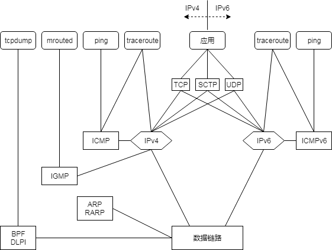
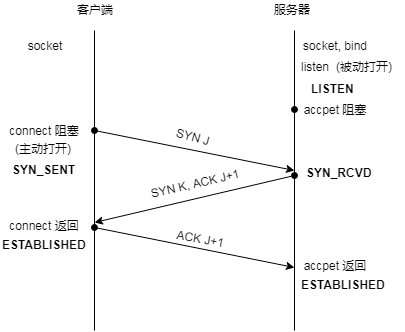
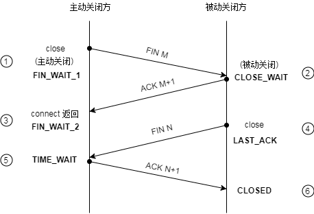
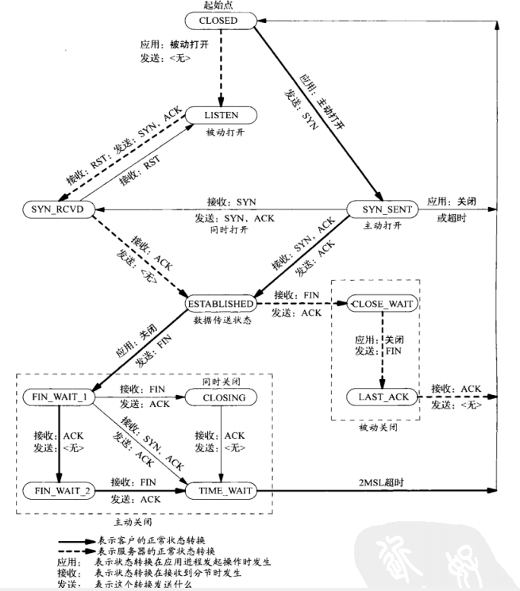
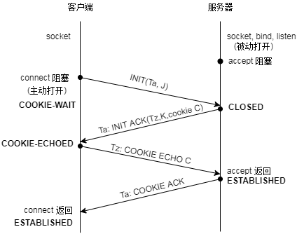
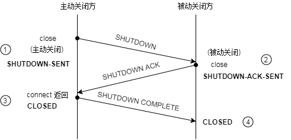
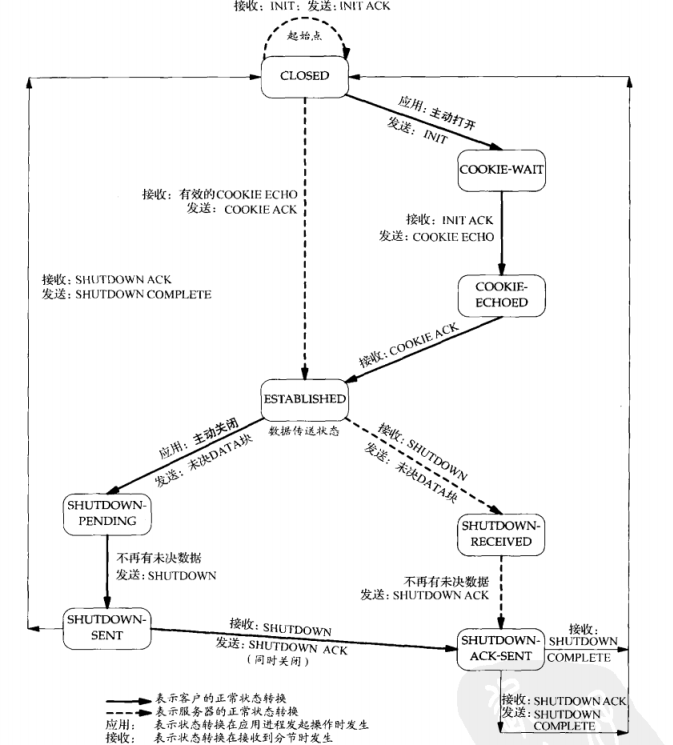
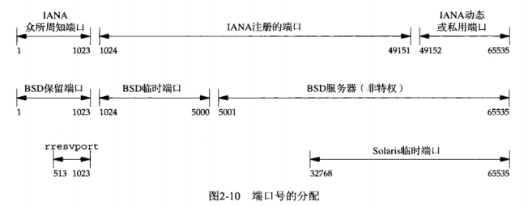
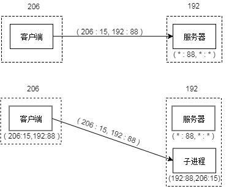

## 第二章 传输层：TCP、UDP、STCP

<<<<<<< 58d4407ae9ceefaa0452cf9e0f94cf3712cd16e4
概览：各个应用使用的协议层次关系

=======
#### 概览

各个应用使用的协议以及层次关系

要点  
>>>>>>> first commit
- 以上未表示SOCK_PACKET绕过传输层的情况
- ICMP 处理路由和主机间的错误和控制消息
- IGMP 用于多播
- ARP把IP地址解析为硬件地址，RARP则反向解析
- IGMPv6包含了ICMP、IGMP、ARP、RARP的功能
<<<<<<< 58d4407ae9ceefaa0452cf9e0f94cf3712cd16e4
- BPF和DLPI提高对数据链路的直接访问
=======
- BPF和DLPI提供对数据链路的直接访问
>>>>>>> first commit

### 特性对比

#### UDP特点
- 无连接、不可靠
<<<<<<< 58d4407ae9ceefaa0452cf9e0f94cf3712cd16e4
- 不保证到达，不保证保持顺序，不保证只接收一次
- 消息有界，数据长度值随报文发送

#### TCP特点
1. 可靠性  
  - 发送后要求对方确认，如超时未收到，则自动重传数次。通过动态估计往返时间(round-trip time,RTT)以确定时限，再次重传时，时限会有所延长，整个过程可能花费数分钟。
  - 关联序号。对发出的每个分节关联一个序号，便于对方接收后重排，保证顺序不变，且无重复。
2. 流量控制  
告知对方，本端当前的接收容量（通告窗口）的大小，以便于对方进行调整。这个数值会实时变动。当通告窗口为零时，代表本端不能接收新数据，需要对方等待。
3. 全双工  
发送和接收两个方向保持独立。亦可转换为半双工。  
> UDP可以是全双工的。  

#### SCTP特点
- 关联：多个连接，提供类似TCP的可靠性、关联序号、流量控制和全双工等特性。
- 面向消息，有界。数据长度随报文发送。
- 多个流，各自独立
- 提供多宿特性，支持多个IP地址

### TCP

#### 三次握手

=======
- 不保证到达，不保证顺序，不保证只到达一次
- 消息有界.数据长度值随报文发送

#### TCP特点
1. 可靠性  
  - 发送后要求对方确认，如超时未收到，则自动重传数次。通过动态估计往返时间(round-trip time, RTT)以确定时限.再次重传时，时限会有所延长.整个过程可能花费数分钟。
  - 关联序号。对发出的每个分节的数据关联一个序号，便于对方接收后重排，保证顺序不变，且无重复。
2. 流量控制  
  告知对方，本端当前的接收缓冲区可用空间（通告窗口）的大小，以便于对方进行调整。这个数值会实时变动。当通告窗口为零时，代表本端不能接收新数据，需要等待应用从缓冲区读取数据时，才能继续接收新数据。
3. 全双工  
  发送和接收两个方向保持独立,因此两个方向的状态和配置可能不同.亦可转换为半双工。  
> UDP可以是全双工的。  

TIP

分节是TCP传递给IP的数据单元.

#### SCTP特点

- 关联：多个连接，提供类似TCP的可靠性、关联序号、流量控制和全双工等特性。
- 面向消息，有界。数据长度随报文发送。
- 拥有多个流，各自独立
- 提供多宿特性，支持多个IP地址

### TCP连接的建立和终止

#### 连接建立

三次握手示意图如下

过程

1. 服务器调用socket bind listen被动打开,以准备接收连接
2. 客户调用connect主动打开,发送SYN分节
3. 服务器发送确认(ACK),以及自己的SYN.这两者在同一个分节中发出
4. 客户发送确认(ACK)

要点

- SYN分节告诉对方，本端在将建立的连接中发送的分节的初始序号。SYN分节通常不携带数据，只携带IP和TCP首部以及可能的TCP选项。
- ACK是确认分节，通常是某个序号加一。

##### TCP选项

每个SYN可以含有多个TCP选项.常见的有

- MSS选项，最大分节大小（maximum segment size). 表示本端在TCP分节中愿意接受的最大数据量,对端会依据这个值做发送调整.可用TCP_MAXSEG选项设置和提取。

- 窗口规模选项。默认为65535，因为TCP首部中相应字段占16位。但是某些技术允许更高的窗口量，该选项指定65535左移的位数，即65535*2^N，其中N在[0,14]之间。可用SO_RCVBUF选项设置和读取。

  > 必须双方都确认对方支持该选项后，才能生效。客户发出该选项的请求，只有在对方的回馈中也包含该选项时才能生效。类似的，服务器在受到对方包含该选项的请求时，才能发送该选项。

- 时间戳。开发者暂可不考虑。

#### 连接终止

四次挥手如下图所示。

过程

1. 主动端调用close进行主动关闭,发送FIN分节
2. 被动端进行确认
3. 被动端主动调用close,发出FIN
4. 主动端进行确认

要点

- 圈2处接收FIN分节，传递EOF(放在排队数据尾)给进程，read函数读至EOF会返回0.

- 圈4处的close是进程主动调用的，而非自动调用的。

- 挥手过程通常需要4个分节。"通常"是因为,可能步骤1的FIN分节随数据合并发送，可能步骤2的ACK和步骤3的FIN合并发送。

- 步骤2和3之间，从被动关闭方到主动关闭方的数据流动是可能的。这称为半关闭（half-close）。

  >FIN的发送仅仅代表本端不再发送数据而已,不代表不可以接收数据.对于close的关闭会在后续章节讨论.

- FIN分节由close操作触发，但进程主动(exit或从main返回)或被动终止(收到终止进程的信号)时都会关闭打开的描述符，也会发出FIN。

- 通常主动关闭方是客户端。

TCP状态转换图

表示状态受接收分节或者进程主动操作而发生转换的情况。

要点

- 上图中默认主动关闭方是客户端,但并不限于客户端。
- 同时打开和同时关闭（simultaneous open/close）的情况很罕见，暂不讨论

#### 关于请求和确认

TCP在发送数据（请求）后，要求对方回复一个确认。如果此时对方需要发送数据作为应答，则确认随应答一起发出，称为捎带(piggybacking), 通常在应答和确认产生间隔200ms内发生。否则,会先确认,后应答.

##### TIME_WAIT

主动发送方在TIME_WAIT状态滞留2MSL时间后转为关闭状态。MSL(maximum segment lifetime)是最长分节生命期，即分节在网络中存活的最长时间，是利用分节中跳限（hop limit）字段实现的。MSL通常默认为30秒或2分钟。

迷途

在网络拥堵或断开重建的过程中，分组可能在某些路由之间来回跳转。而在迷途期间，发送方超时重传，并且重传的分节最终到达目的地。迷途的分组是意外而多余的，迷途的分组可能在不久后到达目的地。迷途的分组称lost dupllicate或漫游的重复分组（wandering duplicate）。

TIME_WAIT存在的意义

- 可靠地实现全双工连接的终止。若最终的ACK丢失，被动关闭方会重传FIN，此时主动方需要维持一个状态，来处理这种情况。若否,主动方在CLOSE状态受到一个FIN会回应RST以表示一个错误。

- 若一个连接终止，而后建立新连接，则新连接被称为旧连接的化身（incarnation）。为了防止旧连接中的报文迷途并延时到达，所以延时2MSL保证旧连接的报文正常消逝。两倍的MSL是主动方的分节,经过发送和回馈两段时间的总和。

  > 例外：如果接收的SYN序号大于旧连接的结束序列号，源自Berkeley的实现会立即建立新连接。

### SCTP的建立和终止

#### 四路握手

过程

1. 服务器被动打开,以准备接受请求
2. 客户端调用connect,发送INIT分节
3. 服务器回馈INIT ACK分节
4. 客户端发送COOKIE ECHO来确认cookie
5. 服务器进行确认

要点

- INIT分节包含本端IP地址清单、初始序号、验证标记、请求的外出流数目和支持的外来流数目
- INIT ACK分节包含本端IP地址清单、初始序号、验证标记、请求的外出流数目和支持的外来流数目，以及状态cookie.状态cookie经过数字签名，包含本端用于确认本关联所需的所有的信息集合。
- COOKIE ECHO分节以及COOKIE ACK分节中可能捎带了用户数据。
- 验证标记：在本次关联中，需要对方发送的每个分节包含该验证标记。
- 握手结束后，两端各自选择一个主目的地址（primary destination address）作为默认目的地址。

#### 关联终止

时序图如下所示。

要点

- SCTP没有半关联状态，一方关闭后，另一方必须立即自行关闭(发送完排队数据后)。圈2处的close是自动调用的[疑]。
- 被动方收到主动关闭请求，会发送EOF给进程，read返回0.
- SCTP没有TIME_WAIT状态，验证标记可以有效地防止旧关联中的迷途分节被新关联误认。
- 圈1处，close调用后，进入SHUTDOWN-PENDING状态；发送完排队数据后才进入SHUTDOWN-SENT状态。
- 圈2处，接收到对方SHUTDOWN后，进入SHUTDOWN-RECEIVED，发送完排队数据后才进入SHUTDOWN-ACK-SENT状态。

#### 状态转移图

要点

- 上图默认是客户端主动关闭。实际上主动关闭不限于客户端。

#### TIP

STCP分组中的信息以块（chunk）为基本单位。块是自描述的，包含块类型、块标记和长度信息。

#### STCP选项

STCP选项仍在扩展中，包括动态地址以及不完全可靠性扩展，前者可以从关联中动态增删地址，后者可以限制陈旧数据的重传。

### 端口号

端口号是用来区分进程的，所以端口号并不是物理的描述。这意味着TCP、UDP和SCTP可以使用同一个端口号。

端口号是16位整数.

IANA维护着端口号分配清单。可以分为

- 众所周知的端口号（well-known）
- 已登记的端口号,可能分配给某些组织
- 临时（动态、私有）端口号

要点

- unix把1-1023端口视作保留端口，分配该端口需要超级用户特权
- 不同的系统实现中，分配情况可能不同
- 某些客户(而不是服务器)需要保留端口用于验证,如上图的rresvport.

#### 套接字对

TCP套接字对是一个定义TCP连接的两个端点的四元组：本地IP和端口+目标IP和端口。分组在接收过程中必须对四个元素都进行验证。

IP地址和端口的组合,本文中称为网络地址,它们定义了一个套接字的地址信息.

SCTP套接字在多宿情况下，可能需要多个四元组。如果的单一连接,则与TCP的四元组无异.

### TCP端口号和并发服务器

一个并发服务器的连接过程如下所示。简便起见，认为服务器IP地址为192，客户端IP地址为206.

过程

1. 服务器建立监听套接字`(*:88,*:*)`,表示接受的连接条件为：不限源IP地址/端口，不限目标IP地址/端口号为88.
2. 客户端发起一个连接请求：`(206:15,192:88)`。服务器验证通过该连接请求，生成已连接套接字用于通信，并托付至子进程。此时连接在客户端和服务器子进程之间建立。

问题

服务器父进程和子进程拥有同一个网络地址。如果另一个客户端发出`(123:20,192:88)`时会发生什么？从目标地址来看，服务器父进程和子进程都拥有(192:88)地址，此时如何判定？  

此时传输层协议会验证发送者地址，发现(123:20)不属于子进程中任意已建立的连接，会递送至父进程。

同理，如果多个客户端分别与多个子进程实现通信，那么根据报文中的四元组，传输层协议会查看源地址来确定投递目标。这是由相关协议自动完成的。

> 可以姑且认为，网络传输过程是由内核直接控制的，进程只是使用内核提供的资源和接口而已。进程可以控制和利用套接字，但进程并不直接拥有和管理套接字。
>
> 进程可以认为是住户，内核是大楼管理者，套接字是住户邮箱。内核接收邮件并分发给各个住户。一个家族可以有多个住户（子进程），这些住户共用一个名字。内核根据邮件发件人，正确分配邮件至各个进程。

### 数据报文大小及限制

原题目为缓冲区大小，相关概念有缓冲区和重组缓冲区，实际表示的是报文长度。

- IPv4数据报最大65535字节，包括IPv4首部。这是因为报文中总长度字段占16位。

- IPv6数据报最大65575字节，包括40字节的IPv6首部。这是因为报文中净荷长度字段占16位。净荷长度不含IPv6首部。

  IPv6有一个特大净荷(jumbo payload)选项，它把净荷长度字段扩展到32位，不过需要MTU超过65535的数据链路提供支持。(通常为主机到主机的内部连接设计)

- MTU（maximum transmission unit,最大传输单元）表示报文的最大字节数。例如以太网的MTU是1500. IPv4要求MTU最低为68字节，包括20字节固定长度和最多40字节的选项部分，以及最小的片段8字节（首部中片段偏移量字段以8为单位）。IPv6要求MTU最小为1280字节，或者依赖特定功能使得链路看起来为1280。

- 在两个主机之间的路径中最小的MTU称为路径MTU，两个方向上的MTU可以是不对称的,这是由于两方向的传输路径可能不一致。

- IP数据报送出时，若超过输出链路的MTU，IPv4和IPv6会分片（fragmentation）。这些片段在到达最终目标前通常不会重组（reassembling）。IPv4主机对其产生的数据报分片，IPv4路由器则对转发的数据报进行分片。IPv6只有主机对其产生的数据报进行分片，IPv6不会对路由器转发的数据报进行分片。不过路由器可能(作为主机)产生数据报并进行分片。

- IPv4首部中“不分片(don't fragment, DF)”位若被设置，则主机和路由器都不会分片。如果路由器收到DF的数据报但是其超出了路由外出链路，则产生一个ICMPv4错误："目的不可达但设置DF位"。IPv6路由器不分片，所以IPv6数据报隐含DF位，此时若数据报过大会产生一个ICMPv6错误：”分组太大“。

  IPv4的DF位和IPv6的隐含DF位可用于路径MTU发现。可以设置DF位，然后尝试发送不同大小的分组，若接收到错误，则减少数据量并重传，以此可推测路径MTU的值。路径发现对于IPv4是可选的，但IPv6的所有实现要么支持它，要么必须总是使用最小的MTU发送。

  > 现今某些防火墙会丢弃ICMP消息，所以路径发现并不可靠。另外有些作为路由器的防火墙有可能重组分片的报文，以验证内容。

- IPv4和IPv6都定义了最小重组缓冲区大小(minimum reassembly buff size)。对于IPv4为576字节，对于IPv6是1500字节。任何IPv4和IPv6的实现必须支持该大小。

- TCP有一个MSS（maximum segment size,最大分节大小）。用于向对端通告自己能接受的TCP分节**数据量**大小，用以顺利通过所有链路并避免分片。MSS经常设置为MTU减去IP和TCP首部的固定长度，如以太网中MTU为1500，IPv4中MSS=1500-20-20=1460，IPv6中MSS=1500-20-40=1440.

  在TCP选项中MSS值是16位的字段，上限为65535，而IPv4数据报中最大数据量为65535-20-20=65495. MSS为65535只对具有特大净荷选项的IPv6有意义，表示不限制MSS值，此时主机和路由器根据具体情况中接口MTU进行分片。如果路径MTU较小，则路径MTU发现功能将确定这个较小值。

- SCTP基于到对端所有地址发现的最小MTU保持一个分片点。SCTP_MAXSEG选项可以设定更小的分片点。

#### TCP输出

每个TCP套接字都有一个发送缓存区。调用write时，内核从进程的缓冲区复制数据到套接字发送缓冲区。如果套接字发送缓冲区无法容下，则该进程投入睡眠（如果套接字是阻塞的）。直到复制完毕后write函数返回。因此，write函数成功返回仅仅表示复制过程完成。

本端套接字把发送缓冲区的数据发送给对端，受到对方的确认后，才会从发送缓冲区丢弃数据。

本端TCP以对端MSS或更小的块(默认536)把数据传递给IP，同时给每个数据库安装TCP首部以构成TCP分节。536=576(最小重组缓冲区字节数)-20-20。

IP给每个TCP分节安装IP首部构成IP数据报，并按照目的IP查找路由表项以确定外出接口，并投递给相应数据链路。投递前可能分片。

每个数据链路都有一个输出队列，如果已满，则新分组会丢弃并产生错误。错误层层上传至TCP，TCP将重传。进程并不了解这些细节。

#### UDP输出

UDP的发送缓冲区并不存在，它虽然有发送缓冲区大小的值，但是仅仅表示写到该套接字的UDP数据报的大小上限。如果进程发送时超过上限，内核将返回进程EMSGSIZE错误。

UDP不会保留数据副本。数据拷贝到内核并在某一级转发后，直接丢弃。

UDP给数据报安装8字节的首部构成UDP数据报，然后传递给IP。

IP安装首部，执行路由操作确认外出接口，传递给数据链路。其间可能分片(如果超出MTU)。由于UDP缺少MSS选项，因而大数据报更可能被分片。

write返回成功表示数据加入到数据链路的输出队列。若后者已满则返回ENOBUFS给进程（但某些UDP不返回这种错误）。

#### SCTP输出

类似于TCP，SCTP有发送缓冲区，可以用SO_SNDBUF选项设置。其他过程基本类似。

### 标准因特网服务

【图】

#### TIP

SCTP中，确认分为累积性确认和选择性确认，后者确认特定序号对应的数据，前者确认特定序号前的所有数据。
>>>>>>> first commit
